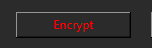
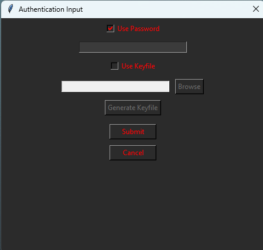
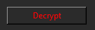

---

# KataKrypt User Guide

Welcome to **KataKrypt**, a user-friendly application that allows you to securely encrypt and decrypt your text files using steganography and keyfiles. This guide is designed for users with little to no experience in cryptography and will answer any questions you might have.


*Insert your application's logo above by replacing the image path.*

## Table of Contents

- [Introduction](#introduction)
- [What is KataKrypt?](#what-is-katakrypt)
- [Key Features](#key-features)
- [Understanding Basic Concepts](#understanding-basic-concepts)
  - [Encryption](#encryption)
  - [Steganography](#steganography)
  - [Keyfiles](#keyfiles)
- [Getting Started](#getting-started)
  - [System Requirements](#system-requirements)
  - [Installation](#installation)
- [Using KataKrypt](#using-katakrypt)
  - [Encrypting a File](#encrypting-a-file)
  - [Decrypting a File](#decrypting-a-file)
- [Authentication Options](#authentication-options)
  - [Password Guidelines](#password-guidelines)
  - [Using Keyfiles](#using-keyfiles)
- [Frequently Asked Questions](#frequently-asked-questions)
- [Troubleshooting](#troubleshooting)
- [Support and Feedback](#support-and-feedback)

---

## Introduction

In today's digital age, protecting your personal information is more important than ever. **KataKrypt** provides an easy way to secure your sensitive data by encrypting it and hiding it within images. With the addition of keyfiles, you have even more control over your data's security. This guide will walk you through every step, ensuring you can use the program confidently, even if you're new to encryption.

---

## What is KataKrypt?

**KataKrypt** is a software application that encrypts text files and embeds the encrypted data into images using steganography. By utilizing passwords and keyfiles, your sensitive information is both encrypted and hidden, adding multiple layers of security.

---

## Key Features

- **User-Friendly Interface**: Simple and intuitive design.
- **Strong Encryption**: Protects your data using a custom encryption algorithm.
- **Steganography**: Hides encrypted data within images.
- **Password and Keyfile Protection**: Secure your data with a password, a keyfile, or both.
- **Cross-Platform**: Compatible with Windows and Linux operating systems.

---

## Understanding Basic Concepts

### Encryption

Encryption is the process of converting readable data (plaintext) into an unreadable format (ciphertext) using a password or key. Only someone with the correct password or key can decrypt and read the original data.

### Steganography

Steganography involves hiding data within other non-secret text or data. In KataKrypt, your encrypted text is hidden within image files, making it inconspicuous and adding an extra layer of protection.

### Keyfiles

A keyfile is a file that contains cryptographic key material used for encryption and decryption. Keyfiles can be used in place of or in addition to a password, enhancing security by requiring possession of a specific file to access the encrypted data.

---

## Getting Started

### System Requirements

- **Operating System**:
  - Windows 7 or later
  - **Or** Linux with Python 3 installed
- **Disk Space**: At least 50 MB of free space
- **Permissions**: Ability to read and write files

### Installation

You can download KataKrypt from the GitHub repository:

[https://github.com/jarch13/KataKrypt.git](https://github.com/jarch13/KataKrypt.git)

#### For Windows Users:

1. **Download** or **Clone** the KataKrypt repository from GitHub.
2. Navigate to the `KataKrypt_Windows` folder.
3. **Double-click** the `KataKrypt.exe` file to run the program—no installation is required.

#### For Linux Users:

1. **Ensure** that Python 3 is installed on your system. You can check by running:

   ```bash
   python3 --version
   ```

   If not installed, you can install it using your package manager, for example:

   ```bash
   sudo apt-get install python3
   ```

2. **Download** or **Clone** the KataKrypt repository from GitHub.

3. Open a terminal and navigate to the `KataKrypt_Linux` folder:

   ```bash
   cd /path/to/KataKrypt/KataKrypt_Linux
   ```

4. **Run** the program using Python 3:

   ```bash
   python3 KataKrypt.py
   ```

---

## Using KataKrypt

### Encrypting a File

1. **Open KataKrypt** by running the executable (Windows) or Python script (Linux).

2. **Access the Encryption Feature**:

   - Click on the **Encrypt** button on the main screen
     *or*
   - Go to **File > Encrypt** from the menu bar.

   

   *Insert a screenshot of the main screen highlighting the Encrypt button.*

3. **Select a Text File**:

   - A file dialog will appear.
   - Navigate to and select the `.txt` file you wish to encrypt.
   - Click **Open**.

4. **Choose Authentication Method**:

   - A dialog box will appear with options to use a **Password**, a **Keyfile**, or **Both**.

   **Use Password**:

   - Check the **Use Password** box (checked by default).
   - Enter a strong password in the field provided.

   **Use Keyfile**:

   - Check the **Use Keyfile** box.
   - Click **Browse** to select an existing keyfile *or* click **Generate Keyfile** to create a new one.
   - If generating, choose a save location and remember where you saved it.

   

   *Insert a screenshot of the authentication dialog.*

5. **Enter Password and/or Keyfile**:

   - Provide the necessary authentication information based on your selections.
   - Click **Submit**.

6. **Choose Save Location for Encrypted Image**:

   - A save dialog will appear.
   - Choose the destination folder and enter a filename for the encrypted image.
   - Ensure the file extension is `.bmp`.
   - Click **Save**.

7. **Confirmation**:

   - You will receive a confirmation message once the encryption and embedding are complete.
   - Click **OK** to finish.

### Decrypting a File

1. **Open KataKrypt** if not already running.

2. **Access the Decryption Feature**:

   - Click on the **Decrypt** button on the main screen
     *or*
   - Go to **File > Decrypt** from the menu bar.

   

   *Insert a screenshot of the main screen highlighting the Decrypt button.*

3. **Select an Encrypted Image**:

   - A file dialog will appear.
   - Navigate to and select the `.bmp` image containing the encrypted data.
   - Click **Open**.

4. **Enter Authentication Information**:

   - Enter the **same password and/or keyfile** used during encryption.
   - Use the **Browse** button to select your keyfile if used.
   - Click **Submit**.

5. **Choose Save Location for Decrypted Text**:

   - A save dialog will appear.
   - Choose the destination folder and enter a filename for the decrypted text file.
   - Click **Save**.

6. **Confirmation**:

   - You will receive a confirmation message once the decryption is complete.
   - Click **OK** to finish.

---

## Authentication Options

### Password Guidelines

Creating a strong password is crucial for the security of your data.

- **Minimum Length**: 8 characters
- **Include**:
  - Uppercase letters (A-Z)
  - Lowercase letters (a-z)
  - Numbers (0-9)
  - Special characters (e.g., !, @, #, $)

**Tips**:

- Avoid common words or phrases.
- Do not use personal information like names or birthdays.
- Use a combination of unrelated words and characters.

### Using Keyfiles

A keyfile adds an extra layer of security by requiring a specific file to unlock your encrypted data.

#### Generating a Keyfile

1. During the authentication step, check the **Use Keyfile** box.
2. Click **Generate Keyfile**.
3. Choose a save location and filename for your keyfile.
4. Keep your keyfile in a secure location.

#### Using an Existing Keyfile

1. Check the **Use Keyfile** box.
2. Click **Browse** and navigate to your keyfile.
3. Select the keyfile and click **Open**.

#### Security Tips

- Store your keyfile in a secure, backed-up location.
- Do not share your keyfile with others.
- Use both a password and a keyfile for maximum security.

---

## Frequently Asked Questions

- **Can I encrypt any type of file?**

  Currently, KataKrypt supports encryption of `.txt` files.

- **What if I forget my password or lose my keyfile?**

  For security reasons, passwords and keyfiles are not recoverable. If you forget your password or lose your keyfile, you will not be able to decrypt the data.

- **Is it more secure to use both a password and a keyfile?**

  Yes, using both provides two-factor authentication, significantly enhancing security.

---

## Troubleshooting

**Problem**: Error during encryption or decryption.

**Solution**: Ensure you are selecting the correct file types and that you have the necessary file permissions. Verify that the password and keyfile entered during decryption match those used during encryption.

---

**Problem**: I can't find my keyfile.

**Solution**: Check the location where you saved the keyfile during generation. If you cannot locate it, and you used only a keyfile (without a password), you will not be able to decrypt your data.

---

## Support and Feedback

If you need assistance or have feedback, please visit our GitHub repository:

[https://github.com/jarch13/KataKrypt.git](https://github.com/jarch13/KataKrypt.git)

You can open an issue or contribute to the project there.

---

## License

This project is licensed under the MIT License - see the [LICENSE](LICENSE) file for details.

---

## Acknowledgments

Thank you for using KataKrypt. Your support and feedback are greatly appreciated!

---

*Note: Replace the image paths with the actual paths to your images in the repository. Ensure that the images are stored in a folder (e.g., `images/`) within your repository.*

---

## Contributing

Contributions are welcome! Please read [CONTRIBUTING.md](CONTRIBUTING.md) for details on the code of conduct and the process for submitting pull requests.

---

## Contact

For further inquiries, you can reach out via:

- **GitHub Issues**: [https://github.com/jarch13/KataKrypt/issues](https://github.com/jarch13/KataKrypt/issues)

---

**Happy Encrypting!**
